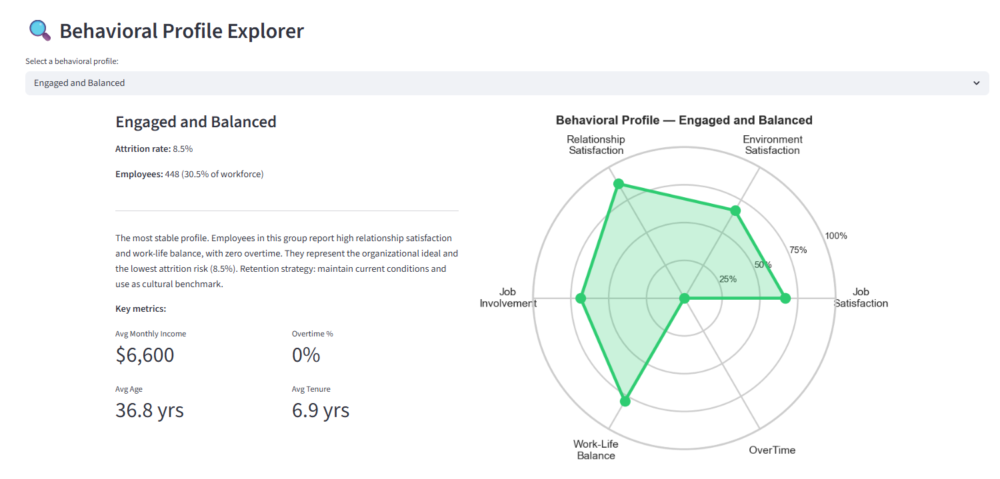
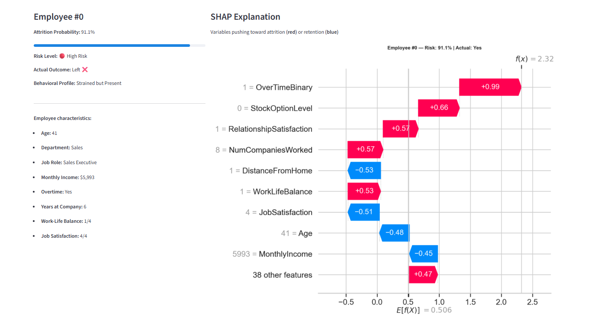

# People Analytics: Behavioral Risk Profiling & Attrition Prediction


## Dashboard Preview

### Workforce Overview & Behavioral Profiles


### Individual Risk Explorer


> **Live demo:** run locally with `streamlit run app/app.py`

> **Can we identify not just *who* will leave, but *why* — and what kind of organizational intervention each risk profile requires?**

---

## Overview

Standard attrition models answer a binary question: will this employee leave? This project goes further. Using psychometric-aligned behavioral variables from the IBM HR Analytics dataset, it builds a **behavioral risk profiling pipeline** that:

1. Segments employees into interpretable behavioral profiles based on satisfaction, engagement, and workload dimensions
2. Predicts attrition probability with an interpretable model (XGBoost + SHAP)
3. Identifies the specific behavioral drivers per profile — enabling targeted, profile-specific interventions
4. Delivers findings through an interactive dashboard designed for HR practitioners and organizational consultants

The analytical lens is deliberately psychometric: variables like `JobSatisfaction`, `WorkLifeBalance`, `JobInvolvement`, and `EnvironmentSatisfaction` are treated not as generic features, but as organizational attitude indicators with construct-level meaning.

---

## Dataset

**Source:** [IBM HR Analytics Employee Attrition & Performance](https://www.kaggle.com/datasets/pavansubhasht/ibm-hr-analytics-attrition-dataset) — Kaggle  
**Records:** 1,470 employees | **Variables:** 35 | **Missing values:** 0  
**Target:** `Attrition` (Yes/No) — 16.1% positive rate (class imbalance treated explicitly)

> This is a synthetic dataset released by IBM for educational and analytical purposes. No real employee data is used.

---

## Project Structure

```
people-analytics-attrition/
│
├── README.md
├── requirements.txt
│
├── notebooks/
│   ├── 01_exploratory_analysis.ipynb      # Narrative EDA with organizational interpretation
│   ├── 02_behavioral_segmentation.ipynb   # K-Means behavioral profiling (k=4)
│   └── 03_predictive_modeling.ipynb       # XGBoost + SHAP interpretable prediction
│
├── src/
│   ├── preprocessing.py                   # Cleaning and feature engineering
│   ├── clustering.py                      # Behavioral segmentation pipeline
│   └── modeling.py                        # Prediction pipeline + SHAP
│
├── app/
│   └── app.py                             # Streamlit interactive dashboard
│
├── reports/
│   └── figures/                           # Exported visualizations
│
└── data/
    └── raw/
        └── HR-Employee-Attrition.csv
```

---

## Analytical Pipeline

### Phase 1 — Exploratory Analysis (`notebooks/`)
Narrative EDA organized around organizational questions, not statistical outputs. Each section addresses a specific behavioral dimension: satisfaction, engagement, workload, and career development. Class imbalance is documented and addressed.

### Phase 2 — Behavioral Segmentation (`src/clustering.py`)
Unsupervised clustering over the psychometric variable subspace to identify behavioral archetypes. Profiles are labeled and interpreted in organizational terms (e.g., *disengaged high-performer*, *overloaded early-career*).

### Phase 3 — Interpretable Prediction (`src/modeling.py`)
XGBoost classifier with explicit handling of class imbalance (`scale_pos_weight`). SHAP values computed globally and per behavioral segment to identify profile-specific attrition drivers.

### Phase 4 — Interactive Dashboard (`app/`)
Streamlit app with:
- Profile explorer: filter by behavioral segment, department, job role
- SHAP waterfall plots per employee/segment
- Intervention recommendations per profile

---

## Key Variables by Analytical Dimension

| Dimension | Variables |
|-----------|-----------|
| Perceived satisfaction | `JobSatisfaction`, `EnvironmentSatisfaction`, `RelationshipSatisfaction` |
| Engagement | `JobInvolvement`, `WorkLifeBalance` |
| Workload & strain | `OverTime`, `BusinessTravel`, `DistanceFromHome` |
| Career development | `YearsSinceLastPromotion`, `TrainingTimesLastYear`, `PercentSalaryHike` |
| Organizational context | `JobLevel`, `JobRole`, `Department`, `YearsWithCurrManager` |

---

## Technical Stack

| Component | Library |
|-----------|---------|
| Data manipulation | `pandas`, `numpy` |
| Visualization | `matplotlib`, `seaborn`, `plotly` |
| Clustering | `scikit-learn` (KMeans, PCA) |
| Modeling | `xgboost`, `scikit-learn` |
| Interpretability | `shap` |
| Dashboard | `streamlit` |

---

## Setup

```bash
git clone https://github.com/Washingtonwlad/people-analytics-attrition.git
cd people-analytics-attrition
pip install -r requirements.txt
```

To run the dashboard locally:
```bash
streamlit run app/app.py
```

---

## Author

**Washington Casamen Nolasco**  
Psychologist · Behavioral Data Scientist  
Specialization: Psychometrics, IRT, People Analytics, Bayesian Modeling  
[GitHub](https://github.com/Washingtonwlad)

---

## License

MIT License — see [LICENSE](LICENSE) for details.
